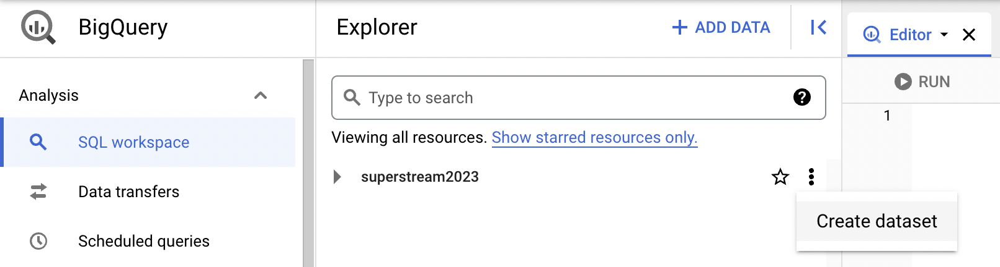

# Adding a Dataset to BigQuery

Data in a BigQuery is organized by:

* Project
* Dataset
* Table

Within your project, to add new data, you first need to create a containing dataset.

1. Within BigQuery find the "Resources" pane on the left side of your screen, and notice the list of BigQuery projects with data you have access to within that Resources pane.  
Depending on whether you have worked on other projects already, you might have several projects listed here, or just your current project.
2. In the "kebab" (three vertical dots) menu on the right side of your current project, select "Create dataset".

3. Give your dataset an ID and change any options you wish to (probably you can leave all the defaults).
4. Click "Create Dataset".

