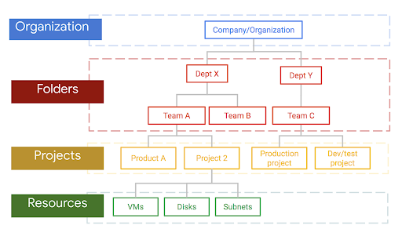
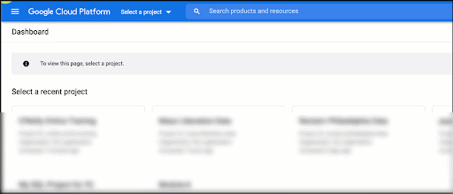

# Creating a New Google Cloud Platform Project

Google Cloud Platform (GCP) organizes your use of its services by the use of **projects**, each of which can have associated **resources**:

To create a new GCP project:

1. If you don't already have an account, create a Google Cloud Platform (GCP) account at https://console.cloud.google.com/.  You'll need a Google identity (whether that's a work-associated account or a gmail addresss).  You can use the free tier for now but you will have to attach a credit card to the account.
2. Log in to your GCP account.  Make sure you're who you think you are by using the profile avatar in the upper right corner. 

The next twosteps are illustrated in this animated gif:

3. In the project picker, you will likely already have a project identified (even if it's your first time in GCP you might have something like "My First Project" selected). Click the downward triangle beside that project name and a project selector menu will appear.
4. Select "New Project". 

Now you have to name your project:

5. Add a project name, and if you want, edit the project ID (optional -- this has to be globally unique, the only GCP project in  the world with this ID).
6. Leave "Location" as "No Organization" (unless you already use Organizations in your company).
7. Click "Create".s