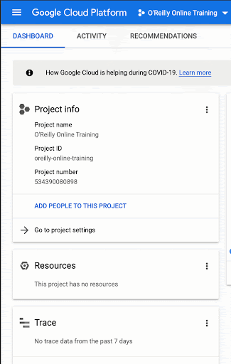

# Enabling BigQuery Within a Project

1. Once you're in your project, click the "burger" menu (☰).
2. Scroll past the "Databases" section.  Yes, BigQuery is similar to other SQL database types, but it's in a different section of the menu.
3. Once you get to "Big Data", click on BigQuery.
4. It might be useful to click the push pin / thumbtack icon to "pin" BigQuery to the top of the menu so you don't have to do all that scrolling again.

