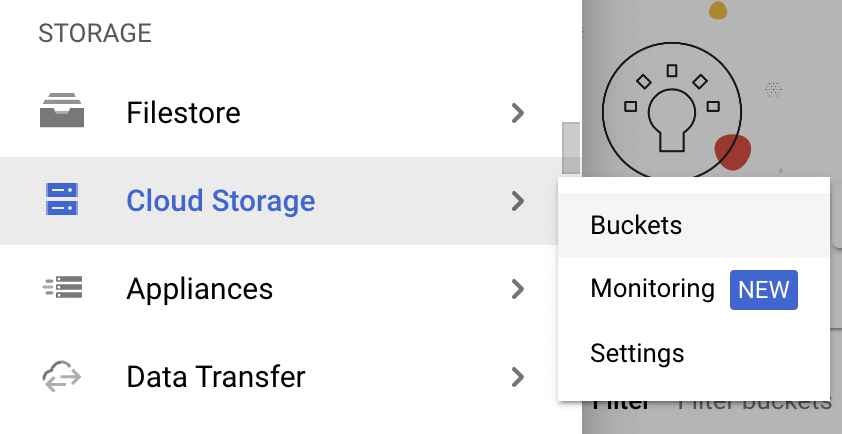

# Enabling Google Cloud Storage (GCS)

Google Cloud Storage (GCS) is a cloud object store that uses buckets to store your objects.  It's great for storing files like .csvs that you might want to bring into BigQuery.  It's also the preferred way to ingest large .csv files.

To add GCS to your project: 

1. Once you're in your project, click the "burger" menu (☰) in the upper left.
2. Scroll to the "Storage" services and choose "Cloud Storage" and then the sub-menu "Buckets".
3. It might be worth clicking the push pin / thumbtack to "pin" GCS to your menu so you don't have to scroll so much in the future.

To create a new bucket to hold files:

1. Click the "Create" button in the Buckets pane.
2. Add a globally unique name (e.g. "test1" won't work, someone else in the world will already have that bucket name).
3. Fill in the other fields as needed (you can probably leave everything else as default).
4. Click "Create".

To add files to a bucket:

1. Open your buckets view within Google Cloud Storage. To find your buckets view, you can scroll to the "Storage" services in the burger menu and choose "Cloud Storage" and then the sub-menu "Buckets".
2. Go to the appropriate bucket in your list of buckets and click on its name.
3. Use the "Upload Files", "Upload Folder", or "Create Folder" as needed to populate your bucket.
4. Change metadata and/or access rules as needed.